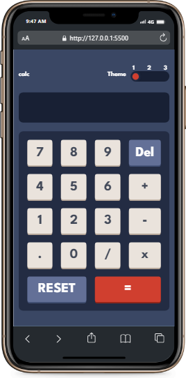
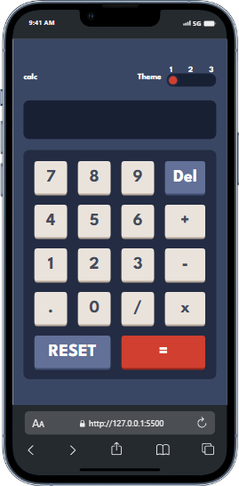
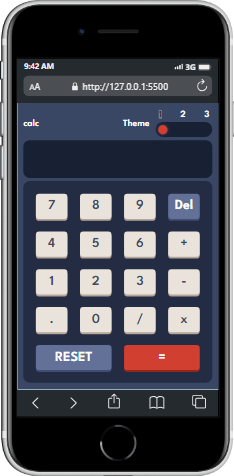

# 3MTT - Calculator app solution

This solution is the mini project on 3MTT training for software development
## Table of contents


  - [The challenge](#the-challenge)
  - [Screenshot](#screenshot)
  - [Links](#links)
  - [Built with](#built-with)
  - [What I learned](#what-i-learned)
- [Author](#author)


### The challenge

Users should be able to:

- See the size of the elements adjust based on their device's screen size
- Perform mathmatical operations like addition, subtraction, multiplication, and division
- Adjust the color theme based on their preference


### Screenshot

  


### Links

- Solution URL: [click](https://github.com/AhmNice/Calculator)
- Live Site URL: [click](https://ahmnice.github.io/Calculator/)


### Built with

- Semantic HTML5 markup
- CSS custom properties
- Flexbox
- CSS Grid
- Mobile-first workflow


### What I learned
```js
toggleSwitch.addEventListener('click', () => {
    body.classList.remove(...modes);
    modeIndex = (modeIndex + 1) % modes.length;
    body.classList.add(modes[modeIndex]);
    toggleSwitch.classList.remove('state-1', 'state-2', 'state-3');
    toggleSwitch.classList.add(`state-${modeIndex + 1}`);
    console.log( modeIndex = (modeIndex + 1) % modes.length)
});
```
## Author

- Website - [Musa Muhammed Awwal](https://www.your-site.com)
- Frontend Mentor - [@ahm_nice](https://www.frontendmentor.io/profile/AhmNice)
- Twitter - [@ahm_nice](https://www.twitter.com/ahm_nice)

*


